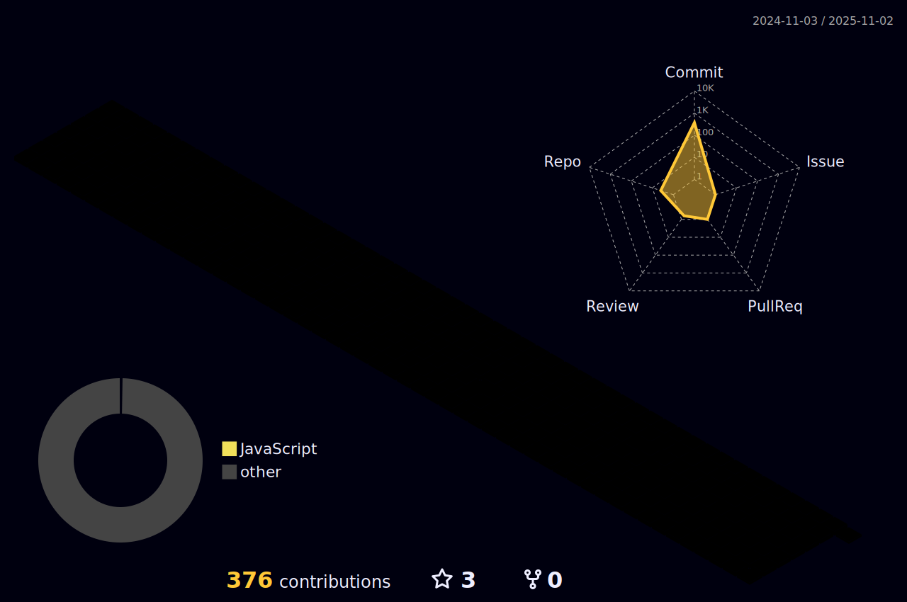

### 🔥 Hey! This is cnsdwu.

- 🔭 I’m currently working on China
- 🌱 I’m currently learning English
- 🤔 I’m looking for help with a job
- 💬 Ask me about javascript/typescript
- 📫 QQ: `90****43`

### 😋 Welcome

### 🧰 Tech Stacks

 

### 💻 Stats

